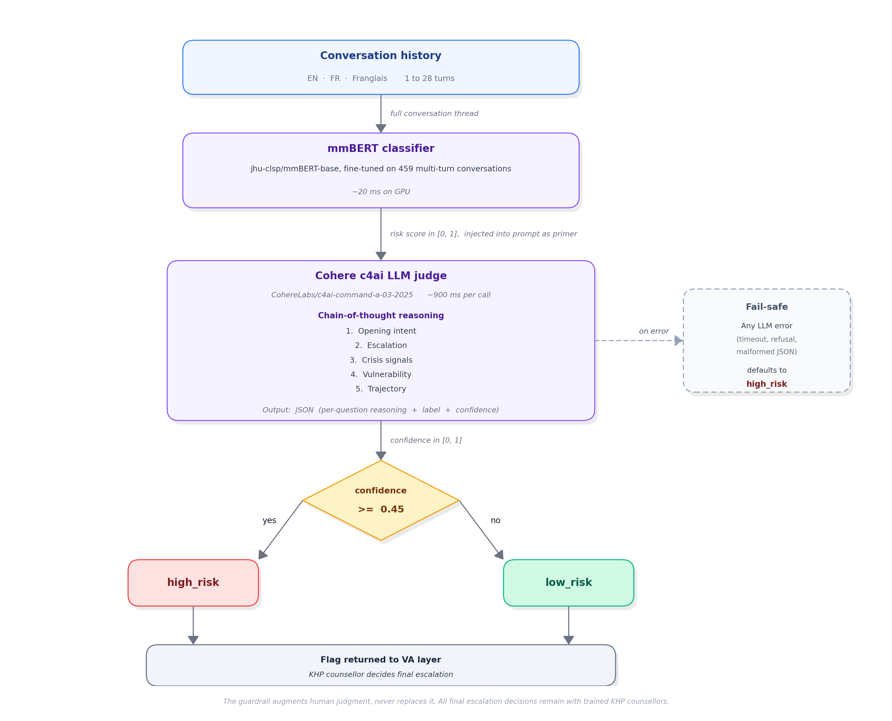

# Multilingual Guardrail for Conversation Safety

A stacked multilingual guardrail (fine-tuned mmBERT classifier plus a Cohere chain-of-thought LLM judge) that screens English, French, and Franglais youth chat conversations for crisis trajectories.

> **Result.** 1st place out of 77 teams at the Bell x Mila x BuzzHPC x Kids Help Phone AI Safety Hackathon.
> **F1 = 0.906**, **Recall = 0.969** on the hidden validation set.

## Context

This system was built for the Bell x Mila x BuzzHPC x Kids Help Phone (KHP) AI Safety Hackathon. KHP is Canada's national mental-health support service for youth, and its virtual assistant (VA) handles first-contact conversations in real time. The brief was to build an input guardrail that detects high-risk conversations (suicidal ideation, abuse, dangerous coping, coercion) across multilingual chat logs, where distress often unfolds gradually rather than appearing in a single message.

The original implementation lives in a now-inaccessible private hackathon repository. This repo serves as a public case study of the architecture, methodology, and results.

## Architecture

The guardrail processes the full conversation history (not just the last turn) and returns a binary label (`high_risk` / `low_risk`) plus a confidence score. Two components run in sequence:

1. **mmBERT classifier** (fine-tuned `jhu-clsp/mmBERT-base`) produces a continuous risk score in [0, 1].
2. **Cohere LLM judge** (`CohereLabs/c4ai-command-a-03-2025`) reasons through a five-question chain of thought and emits the final label.

The classifier score is **prepended to the LLM prompt as a prior signal** rather than ensembled directly. Empirical tests showed that direct ensemble weighting (even at 5 to 15 percent) degraded F1 because the classifier scored near zero on French-language euphemistic crises. The LLM judge therefore holds final decision authority. On any LLM failure, the system fails safe to `high_risk`.

<i>End-to-end flow: full conversation history is scored by the fine-tuned mmBERT classifier, the score is injected into the Cohere c4ai prompt as a prior signal, the judge reasons through the five-question chain of thought, and the result (with confidence) is routed to a KHP counsellor for the final escalation call. Any LLM error fails safe to <code>high_risk</code>.</i>

## Five-question chain-of-thought framework

The LLM judge does not classify directly. It is prompted to answer five questions before reaching a verdict:

1. **Opening intent.** Is the user expressing a real problem or testing the service?
2. **Escalation.** Does distress increase, stay stable, or resolve across turns?
3. **Crisis signals.** Are explicit or euphemistic crisis markers present anywhere in the conversation?
4. **Vulnerability.** Does the user express complete isolation, hopelessness, or absence of support?
5. **Trajectory.** Is the conversational arc moving toward crisis even without explicit keywords?

This reasoning framework was the single most impactful architectural decision: it lifted F1 from 0.667 to 0.899 over a direct-classification baseline. Full prompt text and rationale per question: [docs/prompts.md](docs/prompts.md).

## Results

Hidden validation set, 102 samples, official `evaluate.sh` harness.

| Metric | Value |
| --- | --- |
| **F1 (best run)** | **0.906** |
| **Recall (best run)** | **0.969** |
| Precision | 0.849 |
| Latency per sample | ~1,161 ms |
| Total latency (102 samples) | 118.4 s |

The system deliberately optimises for recall: in the KHP context a missed crisis is far more harmful than an unnecessary counsellor handoff. F1 varies roughly ±0.015 between runs because of Cohere's non-deterministic decoding; stable expected F1 is 0.885 to 0.900, with 0.906 as the best observed. Detailed evaluation: [docs/evaluation.md](docs/evaluation.md).

## My contribution

**Yanis Chalel, lead engineer.** End-to-end ownership of the modelling stack:

- Selected mmBERT-base after benchmarking multilingual encoders for French, English, and Franglais coverage.
- Built the fine-tuning pipeline on the team's annotated multi-turn corpus.
- Designed the Cohere judge prompt and the five-question chain-of-thought framework.
- Compared candidate LLM judges (Cohere c4ai, GPT-OSS-120B, Nemotron-Super-120B, Mistral-Large-3) on refusal rate, JSON formatting reliability, and validation F1; selected Cohere on the basis of zero content-filter refusals.
- Built the evaluation harness, tuned the decision threshold (0.45), and implemented fail-safe escalation.

## Team

Team **Lowkey Critical** (team_044):

- Yanis Chalel, lead engineer
- Wassila Bahloul
- Rébecca Dupuis
- Marie Annie Saucier

## Followup

The project was selected for presentation at the **CRIM 40th Anniversary Conference**, March 2026.

## Further reading

- [docs/architecture.md](docs/architecture.md), the stacked design, why two stages, latency budget, fail-safe behavior.
- [docs/evaluation.md](docs/evaluation.md), dataset, splits, metric definitions, baseline comparisons, error analysis.
- [docs/prompts.md](docs/prompts.md), the full five-question prompt, English and original French.

## License

[CC BY 4.0](LICENSE).
